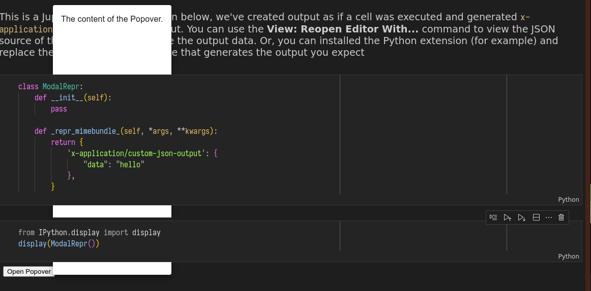

# modal-vscode-reproducer README

Reproducer to show issues with showing popovers a vscode notebook renderer.

Here is what it looks like when the extension is running -

## Running this Sample

 1. `code-insiders modal-vscode-reproducer`: Open the folder in VS Code Insiders
 1. Hit `F5` to build+debug

## Structure

A Notebook Renderer consists of code that runs in the VS Code Extension Host (Node.js), which registers the renderer and passes data into the UI code running inside a WebView (Browser/DOM).

This uses TypeScript project references. There are three projects in the `src` directory:

 - `extension` contains the code running in Node.js extension host. It's compiled with `tsc`.
 - `client` is the UI code, built by Webpack, with access to the DOM.
 - `common` contains code shared between the extension and client.

When you run `watch`, `compile`, or `dev`, we invoke both `tsc` and `webpack` to compile the extension and the client portion of the code.
